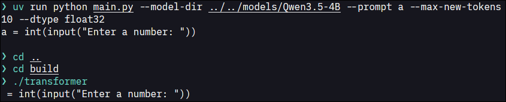
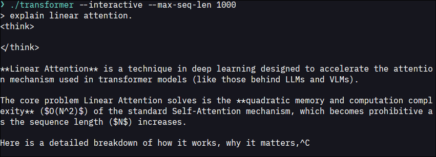
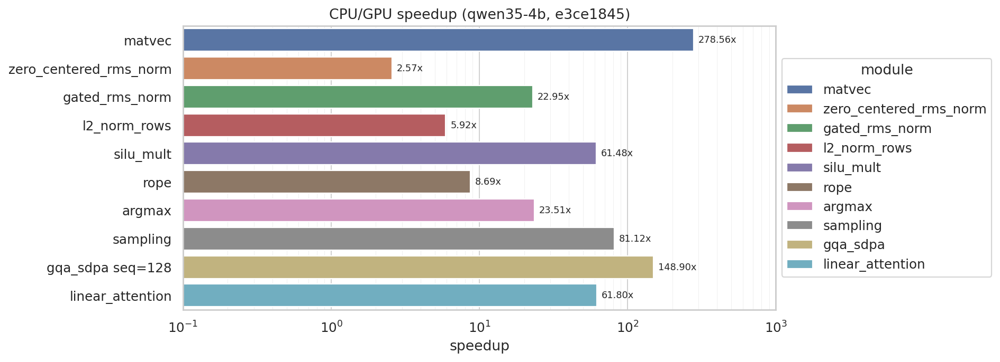

# CUDA Qwen3.5 Inference

CS179 final project for extending the course transformer implementation toward
Qwen3.5 autoregressive inference.

## Build CUDA Code

```bash
cmake -S . -B build
cmake --build build -j
```

## Install Python Reference Environment

```bash
uv sync
```

Run the reference implementation with:

```bash
uv run python pyref/main.py --model-dir models/Qwen3.5-0.8B --prompt a --max-new-tokens 100 --dtype float32
```

## Install Plotting Environment

```bash
cd plots
uv venv --python 3.13
uv pip install -r requirements.txt
```

Regenerate benchmark plots with:

```bash
uv run python plot_benchmarks.py --results-dir ../bench-results --out-dir ../bench-plots --replot-all
```

## Install Model Files

Model directories belong under `models/`. This directory is git-ignored because
checkpoints are large.

Example small checkpoint used for local testing:

```bash
mkdir -p models/Qwen3.5-0.8B
curl -L -o models/Qwen3.5-0.8B/config.json https://huggingface.co/Qwen/Qwen3.5-0.8B/resolve/main/config.json
curl -L -o models/Qwen3.5-0.8B/tokenizer.json https://huggingface.co/Qwen/Qwen3.5-0.8B/resolve/main/tokenizer.json
curl -L -o models/Qwen3.5-0.8B/model.safetensors.index.json https://huggingface.co/Qwen/Qwen3.5-0.8B/resolve/main/model.safetensors.index.json
curl -L -o models/Qwen3.5-0.8B/model.safetensors-00001-of-00001.safetensors https://huggingface.co/Qwen/Qwen3.5-0.8B/resolve/main/model.safetensors-00001-of-00001.safetensors
```

The C++ executable defaults to `models/Qwen3.5-4B`. To run a different local
checkpoint:

```bash
export TRANSFORMER_MODEL_DIR="$PWD/models/Qwen3.5-0.8B"
```

## Project Description and Features

This project extends the Qwen 2.5 0.5B implementation so that it can load and
run Qwen3.5-style models.

There were 3 main new computations I did. The first was Flash attention for
Qwen 3.5 GQA. The second, and more novel one, was the Gated DeltaNet layer.
Instead of storing all previous keys and values and doing full softmax
attention at every layer, the linear-attention layers keep a recurrent state
that is updated as tokens stream through the model:

```text
prediction_t = state_{t-1} * key_t
delta_t = value_t - prediction_t
state_t = decay_t * state_{t-1} + step_t * outer(delta_t, key_t)
output_t = state_t * query_t
```

The last was temperature sampling (not just argmax). This one was a combination
of a reduction prefix sum and another reduction for picking a sampled point
in an unnormalized CDF.

Including the above two, my new implementation includes:

- loading different Qwen3.5 model sizes, currently 0.8B, 2B, 4B, and 9B shapes, for
  both bf16 and float32 (although I didn't do explicit instantions for bf16
  since my RTX 2070 Super doesn't support it),
- a Python reference implementation for Qwen3.5 pieces,
- CPU kernels for debugging,
- CUDA matrix-vector multiplication,
- zero-centered RMSNorm,
- gated RMSNorm and row L2 normalization,
- RoPE changes for the Qwen3.5 shapes,
- flash-attention-style grouped-query attention,
- CUDA Gated DeltaNet / linear-attention recurrent update,
- temperature sampling,
- an end-to-end autoregressive decoding path,
- an interactive chat interface from the course starter code.

## Expected Results and Screenshots

Run all test cases:

```bash
cd build
ctest --output-on-failure
```

Run the CUDA executable:

```bash
cd build
TRANSFORMER_MODEL_DIR=../models/Qwen3.5-0.8B ./transformer --max-seq-len 100
```

Run the interactive chat interface:

```bash
cd build
TRANSFORMER_MODEL_DIR=../models/Qwen3.5-0.8B ./transformer --interactive --max-seq-len 10000
```

Run the Python reference on the same checkpoint:

```bash
uv run python pyref/main.py --model-dir models/Qwen3.5-0.8B --prompt a --max-new-tokens 100 --dtype float32
```

The deterministic CUDA path and Python reference should be compared on the same
checkpoint, dtype, prompt/token stream, and temperature (example in `img/deterministic.png`, default behavior for Qwen 3.5 4B).

[](img/deterministic.png)

[](img/interactive.png)

## Performance Analysis

Note: These were run on my PC, specs are AMD Ryzen 7 3700X (16 core) @ 3.600GHz with 32GB DDR4 and NVIDIA GeForce RTX 2070 SUPER with 8GB.

Benchmarks are run through `bench-module.sh`, which records the current git
commit in each result file:

```bash
cmake --build build -j
./bench-module.sh --module all --preset qwen35-4b --json bench-results
```

Compare the custom CUDA implementation against the fastest Hugging Face CUDA
path supported by the current GPU. Volta and newer GPUs use a static cache with
`torch.compile`/Inductor. Older GPUs such as Pascal automatically use eager CUDA
with the default dynamic cache because Triton requires compute capability 7.0
or newer. Lazy initialization and any compilation/autotuning occur during an
unmeasured warmup generation:

```bash
cmake --build build -j
TRANSFORMER_MODEL_DIR="$PWD/models/Qwen3.5-0.8B" \
  ./bench-forward.sh --dtype fp32 --temperature 0 --warmup-tokens 8 \
  --measure-tokens 32 --max-seq-len 128 --json bench-results
uv run python plots/plot_benchmarks.py --results-dir bench-results \
  --out-dir bench-plots --replot-all
```

This produces separate JSON results and a `huggingface_vs_cuda` decode-latency
plot. Hugging Face also reports batched prefill throughput and time to first
token. The custom implementation currently processes its prompt serially, so
its prefill result will be added once a true batched prefill path exists.

The handwritten PyTorch code under `pyref/` remains a deliberately direct,
naive reference for understanding and checking the Qwen3.5 architecture. It is
not used as the performance baseline.

The benchmark JSON files are in `bench-results/`. The plot directories in
`bench-plots/` are named by git commit. The latest checked-in benchmark is:

```text
bench-results/module-all-e3ce18459048.json
bench-plots/e3ce1845/
```

The latest benchmark README records the main improvements after the initial
implementation:

- parallelized prefix sum/search for sampling,
- parallelized linear attention Gated DeltaNet using strategy 3 in the header,
- flash attention for GQA,
- block reduction for matrix-vector multiplication.



## Potential Improvements

- Fuse small kernels such as normalization, gating, and activation where possible
  to reduce launch overhead.
- Improve matvec tiling.
- Add a real prefill implementation for multi-token prompts instead of only
  single-token decoding (causal sdpa).
- Add batching, top-k/top-p sampling, and more production-style cache management.
- Add true quantized weight loading and inference. Even though I did implement
  templated `compute_t, weight_t, and hidden_t`, actually loading quantized weights
  was different than what I thought (you need to store them as scale and quantized
  factor, not just different float types), so I was not able to get to this
  within the project time constraints.
